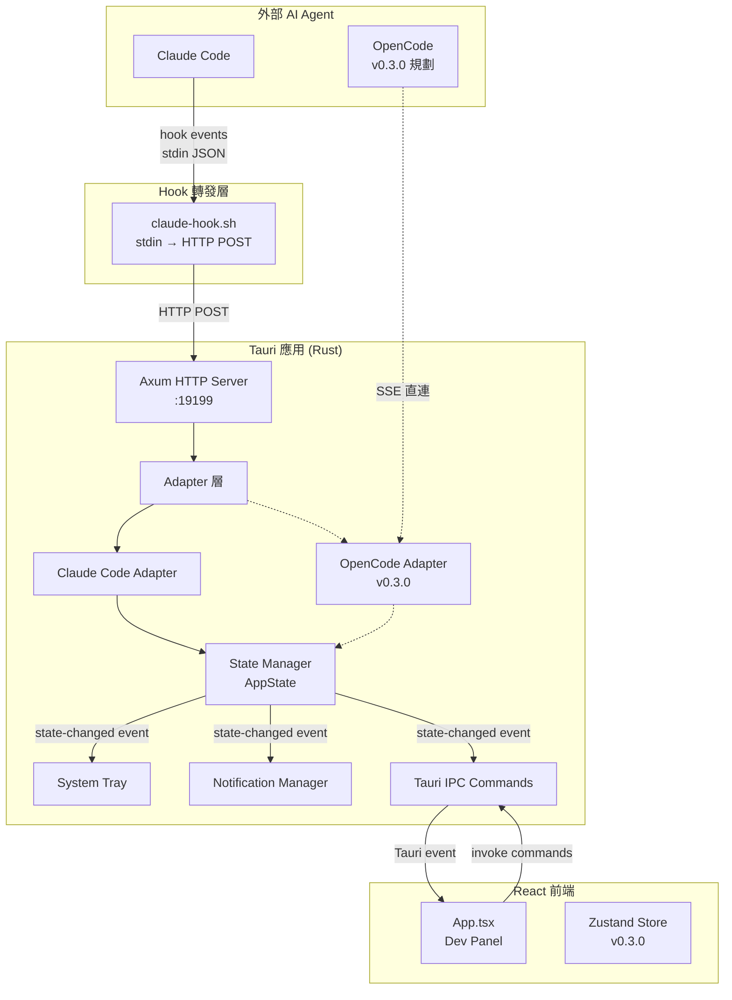
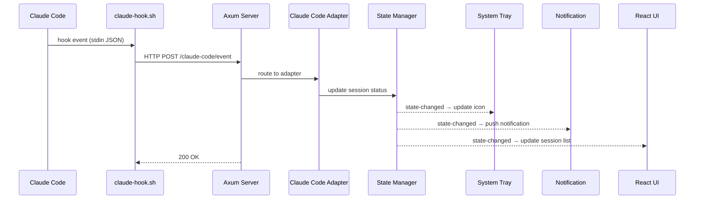
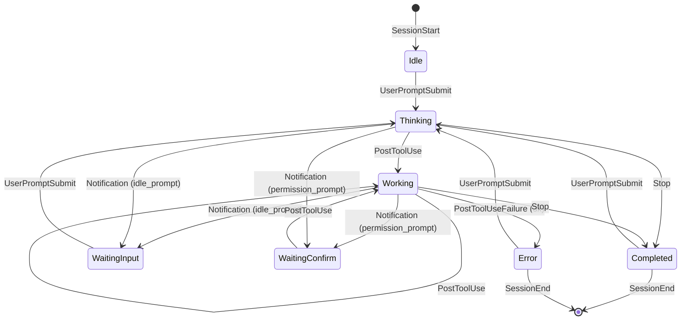

# Architecture — Code Buddy

> Version: 0.2.0 | Updated: 2026-02-26

## System Overview

Code Buddy 是一款輕量桌面應用，透過系統匣圖示與桌面通知即時監控 AI coding agent 的工作狀態。採用 **Rust-Heavy** 架構：所有核心邏輯（狀態機、事件路由、通知管理）在 Rust 端實現，React 僅負責 UI 渲染。

**設計目標**：低 CPU / 記憶體佔用、無侵入式偵測、可擴展多種 agent。

## Architecture Diagram



## Module Description

### Rust 後端 (`src-tauri/src/`)

| 模組 | 檔案 | 職責 |
|------|------|------|
| **State Manager** | `state.rs` | 全域狀態管理、Session 追蹤、狀態聚合策略（pinned > focus > aggregate） |
| **HTTP Server** | `server.rs` | Axum 伺服器，監聽 `localhost:19199`，路由：`GET /health`、`POST /claude-code/event` |
| **Adapter 層** | `adapters/mod.rs` | `AgentAdapter` trait 定義，統一多種 agent 的介面 |
| **Claude Code Adapter** | `adapters/claude_code.rs` | Hook 事件 → 狀態轉換邏輯，支援 8 種事件類型 |
| **OpenCode Adapter** | `adapters/opencode.rs` | [TODO v0.3.0] SSE 直連 |
| **System Tray** | `tray.rs` | 系統匣圖示管理、菜單（顯示面板 / 關於 / 退出） |
| **Notification** | `notification.rs` | 桌面通知推送，含 30 秒防重複機制 |
| **IPC Commands** | `commands.rs` | Tauri 前後端通訊命令：`get_sessions`、`get_current_status`、`switch_tray_icon` |
| **App Entry** | `lib.rs` | 應用初始化：plugin 註冊、tray 設定、HTTP server 啟動 |

### React 前端 (`src/`)

| 模組 | 檔案 | 職責 |
|------|------|------|
| **Dev Panel** | `App.tsx` | Session 列表即時顯示、狀態測試按鈕 |
| **Store** | `store.ts` | [TODO v0.3.0] Zustand 狀態管理 |
| **Components** | `components/` | [TODO v0.3.0] StatusPanel、SessionList、BuddyAnimation、Settings |

### 腳本 (`scripts/`)

| 腳本 | 職責 |
|------|------|
| `claude-hook.sh` | Claude Code hook 事件轉發（stdin JSON → HTTP POST） |
| `tauri-dev-bg.sh` | 背景啟動開發模式 |
| `tauri-dev-stop.sh` | 停止背景開發模式 |

## Technology Stack

| 類別 | 技術 | 版本 |
|------|------|------|
| 桌面框架 | Tauri | 2.x |
| 後端語言 | Rust | 2021 edition |
| HTTP 框架 | Axum | 0.7 |
| 非同步執行 | Tokio | 1.x |
| 前端框架 | React | 19.x |
| 前端語言 | TypeScript | 5.6+ |
| 建置工具 | Vite | 6.x |
| 通知 | tauri-plugin-notification | 2.x |

## Data Flow

### Hook 事件處理流程



### 狀態轉換圖



### 多 Session 狀態聚合

```
優先順序：pinned session > focus session > aggregate（所有 session 最高優先狀態）

狀態優先級：
  WaitingInput / WaitingConfirm (5) > Error (4) > Working (3) > Thinking (2) > Completed (1) > Idle (0)
```

## Design Decisions

| 決策 | 理由 |
|------|------|
| Hook-based 偵測 | 無侵入式，不依賴 agent 內部 API，維護成本低 |
| Rust-Heavy 架構 | 系統匣與通知需要原生效能，Rust 確保低資源佔用 |
| Axum HTTP server | 輕量非同步 HTTP，與 Tauri 的 Tokio runtime 共用 |
| 靜默失敗策略 | Hook 腳本不阻塞 Claude Code，curl 超時 2 秒 |
| 防抖機制 | PostToolUseFailure 需連續 3 次才轉 Error，避免狀態閃爍 |
| 通知防重複 | 同一 session:status 組合 30 秒內最多一次 |
